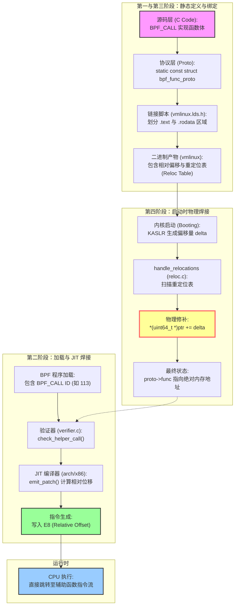

> 在 eBPF 开发中，辅助函数（Helper Functions）是连接沙箱代码与内核原生的唯一桥梁， 辅助函数既不是动态加载的插件，也不是脆弱的符号引用。它们是在内核启动那一刻，由引导代码根据链接脚本的‘施工图’，强行焊接在内存只读区域的物理基石。

本文起源于我在开发ebpf程序时思考辅助函数到底是什么？它和内核提供的其他函数有什么区别？ 。 本文记录了我是如何通过源码分析、逆向思考和底层调试，一步步打通 eBPF 辅助函数逻辑的全过程。所有的代码均出自于5.15.0-139内核源码

---

## 第一阶段：初探辅助函数 —— 桥梁的本质与归属

> **eBPF 辅助函数（Helper Functions）到底是谁提供的？是用户态的 libbpf 库吗？如果不使用辅助函数，eBPF 程序还能运行吗？**

在 5.15 版本中，我们要明确一个核心概念：**eBPF 程序是运行在内核沙箱中的“外聘代码”**。为了系统安全，内核严格限制了 eBPF 的权限。

#### 1\. 归属权确认：Libbpf 只是“翻译官”

在开发 eBPF 项目时，我们会包含 `<bpf/bpf_helpers.h>`。但在 5.15 的内核源码中，这个头文件最终映射的是内核定义的函数 ID。在 5.15 内核中，辅助函数 ID 的定义并没有采用一行一行的硬编码，而是使用了高阶宏（Higher-order Macro）。

```c
/* include/uapi/linux/bpf.h (Line 5020+) */
#define __BPF_ENUM_FN(x) BPF_FUNC_ ## x
enum bpf_func_id {
    __BPF_FUNC_MAPPER(__BPF_ENUM_FN)
    __BPF_FUNC_MAX_ID,
};
```

* `__BPF_FUNC_MAPPER` 是一个巨大的宏，列表里存着所有的函数名（如 `map_lookup_elem`, `probe_read_kernel` 等）。
    
* 通过 `#define __BPF_ENUM_FN(x) BPF_FUNC_ ## x`，内核将列表里的名字自动拼接成 `BPF_FUNC_map_lookup_elem` 这种枚举常量。 **结论**：libbpf 只是提供了一个 Wrapper（当然还有加载功能）。当你调用函数时，它只是告诉内核：“我要执行 113 号功能”。
    

#### 2\. 沙箱机制：为何非它不可？

在 5.15 内核中，eBPF 指令集被设计为无法直接解引用（dereference）内核指针。如果你尝试在 C 代码中写 `char *p = (void *)0xffffffff...; char c = *p;`，**BPF 验证器（Verifier）** 会在加载阶段报错：`R1 invalid mem access`。

* **辅助函数的作用**：它们是内核通过 `EXPORT` 或 `PROTO` 方式暴露的受控 API。
    
* **核心功能**：只有通过辅助函数（如 `bpf_probe_read_kernel`），内核才会代劳去读取敏感地址的内容，并验证该操作是否越界或非法。
    

#### 3\. 不使用的后果

如果不使用 Helper：

* 你无法访问 **Map**（没有 `bpf_map_lookup_elem`）。
    
* 你无法获取 **PID/UID**（没有 `bpf_get_current_pid_tgid`）。
    
* 你无法输出 **Debug 信息**（没有 `bpf_trace_printk`）。 也就是说你的程序将变成一个只能在寄存器里做加减法的隔离孤岛，无法与现实世界交互。
    

---

**第一阶段小结：** 我们确立了辅助函数是**内核提供的核心能力**，它们的存在是为了在**安全沙箱**与**内核特权**之间建立一条合法的信道。

---

## 第二阶段：指令级解密 —— `BPF_CALL` 的蜕变

> **内核在 JIT（即时编译）时，是如何根据一个简单的整数 ID（如 113），精确找到并填入内核函数绝对内存地址的？**

第二阶段标志着 eBPF 程序从“虚拟指令”向“实体机器码”的飞跃。这个阶段的核心任务是：**验证器（Verifier）通过 ID 找到函数原型，并由 JIT 编译器将该原型的物理地址“焊死”在指令流中。**

### 1\. 逻辑绑定：验证器寻址 (Verifier Stage)

当 eBPF 字节码加载到内核时，首先进入 `check_helper_call` 函数。此时指令中仅包含由 `__BPF_FUNC_MAPPER` 宏生成的整数 ID（立即数 `imm`）。

```c
/* kernel/bpf/verifier.c */
static int check_helper_call(struct bpf_verifier_env *env, struct bpf_insn *insn, ...)
{
    const struct bpf_func_proto *fn = NULL;
    int func_id = insn->imm; // 1. 提取工号（如 113）

    // 2. 核心映射：根据 ID 查表获取函数原型 (Prototype)
    if (env->ops->get_func_proto)
        fn = env->ops->get_func_proto(func_id, env->prog);
    
    // 3. 安全审计：利用原型中的元数据（如 arg1_type）检查寄存器 R1-R5 是否合法
    err = check_func_proto(fn, func_id);
    ...
}
```

* **关键发现**：验证器并不关心函数叫什么名字，它通过 `get_func_proto` 回调函数，直接定位到内核内存中静态定义的 `struct bpf_func_proto`。这个结构体中已经预存了辅助函数在内核 `.text` 段的**原始指针**。
    

---

### 2\. 物理焊接：JIT 地址修补 (JIT Stage)

验证器通过后，JIT 编译器（对于 x86 架构即 `arch/x86/net/bpf_jit_comp.c`）开始接管。它负责将 `BPF_CALL` 转换成 CPU 直接识别的 `CALL` 指令。

```c
/* arch/x86/net/bpf_jit_comp.c */
static int emit_patch(u8 **pprog, void *func, void *ip, u8 opcode)
{
    u8 *prog = *pprog;
    s64 offset;

    // 1. 计算相对位移
    // func: 辅助函数在内核代码段的绝对地址
    // ip:   当前 eBPF 指令在内存中的位置
    offset = func - (ip + X86_PATCH_SIZE); 

    // 2. 范围检查：x86 的 CALL 指令只支持 32 位（±2GB）偏移
    if (!is_simm32(offset)) {
        pr_err("Target call %p is out of range\n", func);
        return -ERANGE;
    }

    // 3. 写入机器码
    // opcode 为 0xE8 (x86 CALL)，offset 为计算出的 4 字节偏移
    EMIT1_off32(opcode, offset); 
    
    *pprog = prog;
    return 0;
}
```

* **计算公式**：`offset = 目标函数地址 - (当前指令地址 + 5)`。
    
* **机器码产物**：该函数执行后，内存中会生成如 `E8 45 AB 32 01` 的 5 字节指令。
    

---

### 3\. 运行真相：硬连线后的极致性能

通过这两个函数的配合，eBPF 辅助函数的调用实现了“三不依赖”\*\*：

1. **不依赖运行时搜索**：地址在加载时就计算好了，运行时没有任何 `find_symbol` 的开销。
    
2. **不依赖符号表**：即使你从内核中抹去 `bpf_probe_read_kernel` 字符串，JIT 后的 `E8` 指令依然能精确跳入目标地址，因为它是基于内存偏移运行的。
    
3. **不依赖间接跳转**：不像 C++ 的虚函数表或动态库的 PLT 表，这是直接跳转（Direct Call），对 CPU 的分支预测器（Branch Predictor）极其友好。
    

---

**第二阶段总结：** 我们打通了从 **ID** 到 **相对偏移量（Offset）** 再到 **x86 机器码（E8）** 的逻辑。辅助函数的调用在此时已经从逻辑层面的“请求”变成了物理层面的“跳转”。

---

## 第三阶段：寻找“平面图” —— `struct bpf_func_proto` 与静态映射表

> **辅助函数的绝对地址到底存放在哪？内核是如何通过代码将函数实现（Implementation）与验证器所需的元数据（Metadata）绑定在一起的？**

第三阶段是寻找那个隐藏在内核深处的“真理大本营”。既然我们已经知道验证器会通过 `get_func_proto` 找地址，那么这些地址到底是以什么样的数据结构、在源码的什么位置被“焊死”的？

#### 1\. 核心容器：`struct bpf_func_proto`

在 5.15 内核中，每个辅助函数都对应一个静态定义的结构体。这个结构体就是我们之前提到的“平面图”。

```c
    struct bpf_func_proto {
        u64 (*func)(u64 r1, u64 r2, u64 r3, u64 r4, u64 r5); // 绝对地址存放点
        bool gpl_only;      // 权限标记
        enum bpf_return_type ret_type;
        union {
            enum bpf_arg_type arg_type[5]; // 参数类型约束
            /* ... */
        };
        /* ... */
    };
```

**结论**：`.func` 成员是灵魂，它在编译链接阶段就被指向了内核 `.text` 段的函数起始位置。

#### 2\. 静态绑定：源码中的“连连看”

我们以常用的 `bpf_probe_read_kernel` 为例，看看它是如何在源码中完成绑定的。

````c
    /* 1. 定义函数体 */
    BPF_CALL_3(bpf_probe_read_kernel, void *, dst, u32, size, const void *, unsafe_ptr) {
        return copy_from_kernel_nofault(dst, unsafe_ptr, size);
    }
    
    /* 2. 定义 Prototype 并完成地址绑定 */
    static const struct bpf_func_proto bpf_probe_read_kernel_proto = {
        .func		= bpf_probe_read_kernel, // 这里直接将函数名赋值给指针
        .gpl_only	= true,
        .ret_type	= RET_INTEGER,
        .arg1_type	= ARG_PTR_TO_UNINIT_MEM,
        .arg2_type	= ARG_CONST_SIZE_OR_ZERO,
        .arg3_type	= ARG_ANYTHING,
    };
    ```
**真相**：在编译阶段，编译器通过 `.func = bpf_probe_read_kernel` 这一行，建立了两者的静态联系。
#### 3.分发枢纽：`get_func_proto` 的实现

由于不同的 eBPF 程序类型（Kprobe, Networking, LSM）能使用的函数范围不同，内核通过不同的回调函数来维护 ID 到 Proto 的映射。
```c
    static const struct bpf_func_proto *
    kprobe_prog_func_proto(enum bpf_func_id func_id, const struct bpf_prog *prog)
    {
        switch (func_id) {
        case BPF_FUNC_map_lookup_elem:
            return &bpf_map_lookup_elem_proto;
        case BPF_FUNC_probe_read_kernel:
            return &bpf_probe_read_kernel_proto; // 根据 ID 返回上面那个结构体
        /* ... */
        default:
            return bpf_base_func_proto(func_id);
        }
    }
````

**结论**：这个 `switch-case` 结构就是验证器在第二阶段调用的 `env->ops->get_func_proto`。它像一个检票口，根据 ID 发放对应的“平面图”。

#### 4\. 存储段：`.rodata` 的物理特性

由于这些 `proto` 结构体都被声明为 `static const`，在链接阶段，链接器会将它们统一放置在内核镜像的 `.rodata` (Read Only Data) 段。

* **安全性**：这意味着一旦内核启动完成，这些映射关系在页表层面是只读的，无法通过常规内核漏洞轻易篡改。
    

---

### 第三阶段总结

通过对 5.15 源码的分析，我们确认了：

1. **物理载体**：辅助函数的绝对地址存储在静态定义的 `struct bpf_func_proto` 的 `.func` 成员中。
    
2. **逻辑绑定**：源码中通过直接赋值符号名完成绑定。
    
3. **分发管理**：内核通过各程序类型专属的 `switch-case` 回调函数，实现从数字 ID 到结构体指针的转换。
    

---

## 第四阶段：终极溯源 —— KASLR 与启动重定位

> **源码中写的** `.func = bpf_seq_printf` 只是个名字。在开启了 KASLR 的内核中，这个名字是如何在启动瞬间变成真实的、可执行的 64 位内存地址的？

第四阶段是整个地址解析链条的补完。我们之前看到的源码赋值（`.func = bpf_probe_read_kernel`）在编译完成后的 `vmlinux` 二进制文件中只是一个静态的偏移量。 本阶段将揭开 **KASLR（内核地址空间布局随机化）** 如何在通电启动阶段，将这些偏移量转化为物理内存中绝对地址

### 1\. 蓝图规划：[`vmlinux.lds`](http://vmlinux.lds)`.h` 的段定义

链接脚本宏 [`vmlinux.lds`](http://vmlinux.lds)`.h` 决定了辅助函数及其指针在内核镜像文件（ELF）中的物理排布。

* **代码段（.text）的预留**： 通过 `TEXT_TEXT` 宏，链接器将所有辅助函数的实现代码打包进内核的代码段。
    

```c
    /* include/asm-generic/vmlinux.lds.h */
    #define TEXT_TEXT \
        ALIGN_FUNCTION(); \
        *(TEXT_MAIN .text.fixup) \
        ...
```

* **只读数据段（.rodata）的坑位**： 通过 `RO_DATA(align)` 宏，内核为 `struct bpf_func_proto` 结构体预留了空间。
    

```powershell
    /* include/asm-generic/vmlinux.lds.h */
    #define RO_DATA(align) \
        .rodata : AT(ADDR(.rodata) - LOAD_OFFSET) { \
            __start_rodata = .; \
            *(.rodata) *(.rodata.*) \
            ...
        }
```

**关键点**：在静态编译完成后，`.rodata` 里的 `proto->func` 指针处存的只是一个基于 **0 地址** 的相对偏移，它还不是一个能直接跳转的地址。

---

### 2\. 现场施工：`handle_relocations` 的物理焊接

当内核通电、解压并准备启动时，`handle_relocations` 逻辑开始介入。这是将“纸面偏移”转化为“内存地址”的唯一机会。

#### A. 计算偏移量（Delta）

```c
/* arch/x86/boot/compressed/reloc.c */
delta = virt_addr - LOAD_PHYSICAL_ADDR;
```

由于开启了 **KASLR**，内核实际加载的虚拟起始地址 `virt_addr` 与编译时的默认基址 `LOAD_PHYSICAL_ADDR` 之间产生了一个随机的差值 `delta`。这个 `delta` 就是所有指针需要修正的增量。

#### B. 物理坐标换算（Map）

```c
map = delta - __START_KERNEL_map;
```

由于此时内核还没有建立复杂的页表，它正在自己的“自映射”空间（self map）里干活。`map` 变量负责将重定位表里记录的逻辑偏移量转换为**当前 CPU 可以直接写入的物理内存指针** `ptr`。

#### C. 指针“硬焊接” (The Core Logic)

这是针对 64 位 x86\_64 架构下，辅助函数指针（8 字节）的终极修补循环：

```c
for (reloc--; *reloc; reloc--) {
    long extended = *reloc; // 从重定位表中读取需要修补的位置偏移
    extended += map;        // 换算成当前内存中的绝对物理位置

    ptr = (unsigned long)extended;
    
    /* 核心操作：此时 ptr 指向的是 .rodata 段中 proto->func 的内存地址。
     * *(uint64_t *)ptr 读取原本的相对偏移。
     * += delta 将 KASLR 的随机增量直接加进去。
     * 最后写回。
     */
    *(uint64_t *)ptr += delta;
}
```

---

### 3\. 结果：为 JIT 准备好的“物理基石”

当 `handle_relocations` 结束那一刻，整个 `.rodata` 段里的 `bpf_func_proto` 结构体发生了质变：

1. **从虚到实**：`proto->func` 里的值现在是一个类似 `0xffffffffb1234567` 的完整 64 位绝对地址。
    
2. **只读锁定**：稍后内核调用 `mark_readonly()`，将这一块内存的页表项设为只读。
    
3. **JIT 读取**：此后，当任何 eBPF 程序加载时，验证器读到的就是这个**已经修补好**的绝对地址。JIT 编译器（`emit_patch`）直接把这个值焊接到生成的机器码 `E8 (offset)` 指令中。
    

---

## 总结

通过对 **Linux 5.15.0-139** 源码的深度解剖，我们打通了 eBPF 辅助函数的全链路逻辑：

* **第一阶段（定义）**：内核通过 `__BPF_FUNC_MAPPER` 宏给辅助函数发“工号（ID）”。
    
* **第二阶段（焊接）**：验证器 `check_helper_call` 负责查表，JIT 编译器 `emit_patch` 通过计算相对偏移实现“硬焊接”。
    
* **第三阶段（映射）**：源码级通过 `static const struct bpf_func_proto` 将函数实现与元数据绑定。
    
* **第四阶段（定位）**：链接脚本 [`vmlinux.lds`](http://vmlinux.lds)`.h` 划分地盘，启动重定位 `handle_relocations` 在通电瞬间完成物理灌注。
    



至此，eBPF 辅助函数完成了它从一个‘宏定义的工号’到‘内存绝对坐标’，再到‘JIT 指令硬链接’的蜕变。理解了 `reloc.c` 里的那一次加法运算，你才真正理解了 Linux 内核是如何在保证 KASLR 随机性的同时，还能赋予 eBPF 近乎原生的执行性能。地址不是幻影，它是被链接脚本和启动代码一锤一钎焊死在内存里的基石。